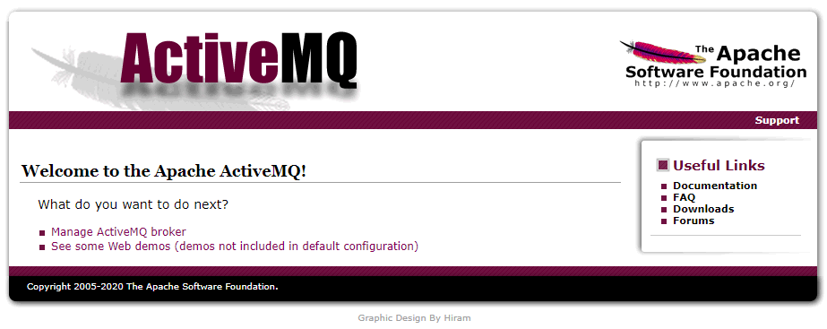

# activemq

This project is a simple example of the communication by Topic using [activemq](http://activemq.apache.org)

## Getting Started

These instructions will get you a copy of the project up and running on your local machine.

### Prerequisites

First, you need to download and install the activemq in your machine

### Download

You can get the activemq here: [http://activemq.apache.org/components/classic/download/](http://activemq.apache.org/components/classic/download/)

### Installing

The guide to install is can be checked here: [https://activemq.apache.org/version-5-getting-started.html](https://activemq.apache.org/version-5-getting-started.html)

### Running

After installing you can go to the "bin" folder and execute the command below:

```
activemq start
```

To make sure that the program is running you can access:

```
http://127.0.0.1:8161/index.html
```

The user and password is "admin"



## Running project

We can run the project in two ways: inside an IDE or using [Maven](https://maven.apache.org/)

### IDE

You should import the project inside your preferred IDE

After this, you can open the class `br.com.rodrigoluisfaria.App` and execute this class as a Java Application

### Maven

After clone or copy the repository, in the root folder you can use the command below to generate a Jar file:

```
mvn install
```

With the Jar generated you can use the command below to execute this file:

```
java -jar target/topic-activemq-sample-1.0-SNAPSHOT.jar
```

## License

This project is licensed under the Apache License 2.0 - see the [LICENSE.md](LICENSE.md) file for details